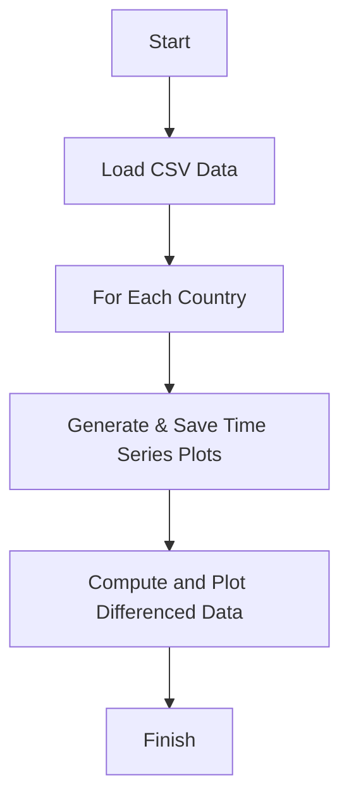
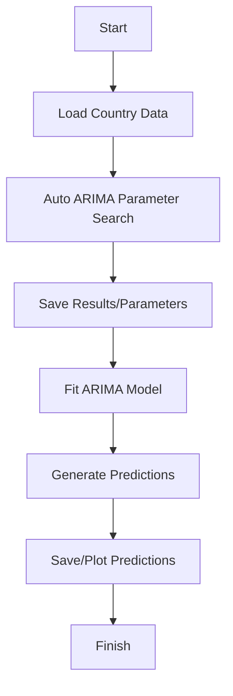
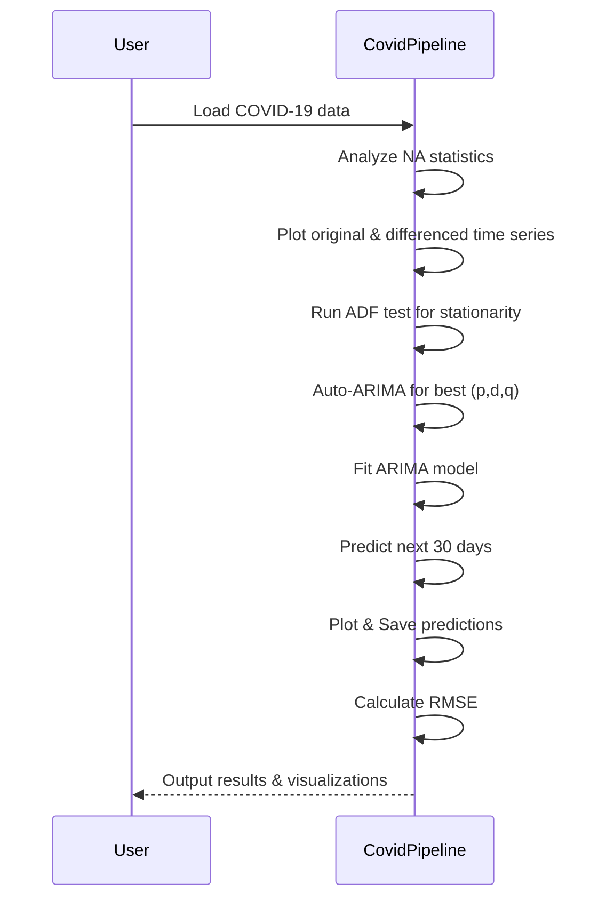
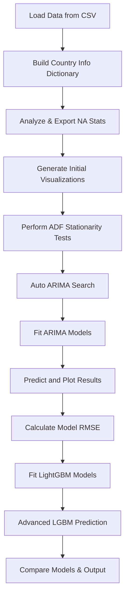

# COVID_CAPSTONE_PROJECT_ARIMA
COVID-19 Time Series Forecasting using ARIMA
# Project Documentation: COVID-19 Time Series Forecasting and Analysis

This project provides a comprehensive pipeline for analyzing, visualizing, and forecasting COVID-19 data for various countries using ARIMA and LightGBM models. It automates preprocessing, time-series stationarity checks, ARIMA hyperparameter selection, prediction, error analysis, and advanced machine learning regression, with a focus on the 'US' and 'India'.

---

## Project Overview

The code processes a CSV file (`covid_19_clean_data1.csv`) containing COVID-19 data (Confirmed, Deaths, Recovered) per country. It performs missing value analysis, generates visualizations, conducts time-series analysis (including stationarity tests and ARIMA modeling), and explores machine learning-based time series predictions.

The primary workflow focuses on these steps:

- **Data Loading & Preparation**
- **Missing Value Analysis**
- **Visualization & Initial Analysis**
- **Stationarity Testing (ADF Test)**
- **ARIMA Parameter Selection & Modeling**
- **Model Evaluation (RMSE)**
- **LightGBM Regression Modeling**
- **Model Comparison & Advanced Prediction**

---

## Imports and Dependencies

The project uses a rich set of libraries for data manipulation, visualization, and modeling.

```python
import math
import os.path
import numpy
import pandas
import copy
import openpyxl
import matplotlib.pyplot as plt
from statsmodels.graphics.tsaplots import plot_acf, plot_pacf
from statsmodels.tsa.stattools import adfuller
from statsmodels.tsa.arima.model import ARIMA
from sklearn.metrics import mean_squared_error
import pmdarima as pm
import lightgbm as ltb
from sklearn.model_selection import train_test_split
import warnings
```

---

## Data Loading

Reads the main COVID-19 data CSV file and identifies the unique countries.

```python
_temp_pd = pandas.read_csv('covid_19_clean_data1.csv', parse_dates=True)
countries_to_check_list = ['US', 'India']
all_countries = _temp_pd['Country/Region'].unique()
```

---

## Directory Setup

Creates necessary directories for organizing outputs and results.

- `pre_data_analysis`
- `preparing_data_for_model`
- `adfuller_test_results`
- `arima_results`
- `prediction_graphs`

---

## Data Structure Construction

Builds a dictionary, `complete_country_info`, holding raw data and NA statistics for each country.

```python
complete_country_info = {}
for each_country in all_countries:
    each_country_info = {
        'name': each_country,
        'raw_data': _temp_pd[_temp_pd["Country/Region"] == each_country]
    }
    each_country_info['na_stats'] = each_country_info['raw_data'].isna().sum()
    complete_country_info[each_country] = each_country_info
```

---

## Missing Value (NA) Statistics Export

Creates an Excel report of missing values per country for Recovered, Confirmed, and Deaths.

```python
na_stats_list = []
for each_country in complete_country_info.keys():
    _temp_dict = {
        'country': each_country,
        'recovered': complete_country_info[each_country]['na_stats']['Recovered'],
        'confirmed': complete_country_info[each_country]['na_stats']['Confirmed'],
        'deaths': complete_country_info[each_country]['na_stats']['Deaths']
    }
    na_stats_list.append(_temp_dict)
_tem_stats_pd = pandas.DataFrame(na_stats_list)
_tem_stats_pd.to_excel('project_na_stats.xlsx', index=False)
```

---

## Data Analysis and Visualization Functions

### `analyse_adjust_data`

Plots and saves time series graphs for each country and attribute (Confirmed, Deaths, Recovered). Can plot original or differenced (lag-1) data.

```python
def analyse_adjust_data(country, is_diff=False, folder_to_save='.'):
    ...
```

---

### `initial_analysis_graphs`

Generates time series plots for the countries of interest.

```python
def initial_analysis_graphs(country_to_check_list):
    for each_country_to_check in country_to_check_list:
        analyse_adjust_data(each_country_to_check, False, folder_to_save='pre_data_analysis')
```

---

### `adjusting_data`

Creates and saves differenced (first difference) time series plots for the selected countries.

```python
def adjusting_data(countries_list):
    for each_country_name in countries_list:
        analyse_adjust_data(each_country_name, True, folder_to_save='preparing_data_for_model')
```

---

### Visualization Workflow

#### Data Analysis and Adjustment Flow



---

## Stationarity Testing (ADF Test)

### `adfuller_test`

Performs the Augmented Dickey-Fuller test on each attribute's time series per country, saving results to text files.

```python
def adfuller_test(data, country, attr):
    ...
```

---

### `check_all_adfuller_test`

Runs the ADF test for all countries and attributes in the focus list.

```python
def check_all_adfuller_test():
    for each_entry in countries_to_check_list:
        for each_attr in ['Recovered', 'Deaths', 'Confirmed']:
            adfuller_test(
                complete_country_info[each_entry]['raw_data'][each_attr],
                each_entry,
                each_attr
            )
```

---

## ARIMA Modeling

### `auto_arima_check`

Uses `pmdarima`'s `auto_arima` to find optimal ARIMA parameters, logs the summary, and stores the best (p,d,q) order.

```python
def auto_arima_check(country, attribute):
    ...
```

---

### `auto_arima_analysis`

Performs ARIMA parameter search for all relevant countries and attributes.

```python
def auto_arima_analysis():
    for each_entry in countries_to_check_list:
        for each_attr in ['Recovered', 'Deaths', 'Confirmed']:
            auto_arima_check(each_entry, each_attr)
```

---

### `fit_arima`

Fits an ARIMA model using previously determined parameters and generates 30-step predictions.

```python
def fit_arima(country, attr):
    ...
```

---

### `all_fit_data_to_arima_model`

Runs ARIMA fitting for all countries/attributes.

```python
def all_fit_data_to_arima_model():
    for each_entry in countries_to_check_list:
        for each_attr in ['Recovered', 'Deaths', 'Confirmed']:
            fit_arima(each_entry, each_attr)
```

---

### ARIMA Model Flow



---

## Model Evaluation and Visualization

### `plot_predictions`

Plots and saves ARIMA model predictions for each country/attribute.

```python
def plot_predictions(country, attr):
    ...
```

---

### `all_plot_graphs_predicted`

Plots all ARIMA predictions for focus countries.

```python
def all_plot_graphs_predicted():
    for each_entry in countries_to_check_list:
        for each_attr in ['Recovered', 'Deaths', 'Confirmed']:
            plot_predictions(each_entry, each_attr)
```

---

### `calculate_mean_squared_error`

Calculates and prints the Root Mean Squared Error (RMSE) between predicted and actual data for the last 31 days.

```python
def calculate_mean_squared_error(country, attr, model):
    ...
```

---

### `all_predict_mean_squared_error`

Performs RMSE calculation for all ARIMA predictions.

```python
def all_predict_mean_squared_error():
    for each_entry in countries_to_check_list:
        for each_attr in ['Recovered', 'Deaths', 'Confirmed']:
            calculate_mean_squared_error(each_entry, attr, 'ARIMA')
```

---

## LightGBM Modeling

### `model_lgbm_fit`

Fits a LightGBM regressor to each attribute's time series for each country, using dates as input and the respective attribute as output. Evaluates RMSE for the last 30 points.

```python
def model_lgbm_fit(country, attr):
    ...
```

---

### `all_lgbm_fit_data`

Runs LightGBM regression for all countries/attributes.

```python
def all_lgbm_fit_data():
    for each_entry in countries_to_check_list:
        for each_attr in ['Recovered', 'Deaths', 'Confirmed']:
            model_lgbm_fit(each_entry, attr)
```

---

### `model_lgbm_fit_v2`

A more advanced LightGBM model using 'Confirmed' and 'Deaths' as features to predict 'Recovered'. Plots both actual and predicted values.

```python
def model_lgbm_fit_v2(country):
    ...
```

---

### `all_lgbm_fit_data_v2`

Runs the advanced regression for all target countries.

```python
def all_lgbm_fit_data_v2():
    for each_entry in countries_to_check_list:
        model_lgbm_fit_v2(each_entry)
```

---

## Summary of Outputs

- **Excel File**: `project_na_stats.xlsx` with missing value stats per country
- **Plot Images**: Time series, differenced series, ARIMA predictions, LightGBM predictions (various folders)
- **Text Files**: ADF test results, ARIMA summaries (per country/attribute)
- **Printed Output**: RMSE scores for ARIMA and LightGBM models

---

## Key Functions Table

| Function Name                | Description                                                                                  |
|------------------------------|---------------------------------------------------------------------------------------------|
| `analyse_adjust_data`        | Plots and saves raw/differenced time series for each attribute and country                  |
| `initial_analysis_graphs`    | Generates initial time series plots for focus countries                                     |
| `adjusting_data`             | Generates differenced plots for focus countries                                             |
| `adfuller_test`              | Performs ADF test on time series, writes results to file                                    |
| `check_all_adfuller_test`    | Runs ADF tests for all selected attributes/countries                                        |
| `auto_arima_check`           | Finds best ARIMA parameters via auto_arima, writes summary to file                          |
| `auto_arima_analysis`        | Runs auto_arima for all selected attributes/countries                                       |
| `fit_arima`                  | Fits ARIMA model and generates predictions                                                  |
| `all_fit_data_to_arima_model`| Fits ARIMA for all selected attributes/countries                                            |
| `plot_predictions`           | Plots ARIMA predicted results                                                              |
| `all_plot_graphs_predicted`  | Plots all ARIMA predictions for focus countries                                             |
| `calculate_mean_squared_error`| Computes and prints RMSE for predictions                                                   |
| `all_predict_mean_squared_error`| Computes RMSE for all ARIMA predictions                                                 |
| `model_lgbm_fit`             | Fits a simple LightGBM regressor for each attribute                                         |
| `all_lgbm_fit_data`          | Runs simple LightGBM regression for all attributes/countries                                |
| `model_lgbm_fit_v2`          | Advanced LightGBM model using multiple features to predict 'Recovered'                      |
| `all_lgbm_fit_data_v2`       | Runs advanced regression for all focus countries                                            |

---

## Example: ARIMA Model Pipeline



---

## Project Structure and Data Flow



---

## Advanced Prediction Example

The advanced regression (`model_lgbm_fit_v2`) leverages multi-feature input to predict 'Recovered'. This approach helps model nonlinear relationships between confirmed, deaths, and recovered, potentially outperforming time-series-only models.

```python
data = pandas.DataFrame(complete_country_info[country]['raw_data'],columns=['Date','Confirmed',"Deaths",'Recovered'])
x_train = data[['Confirmed','Deaths']]
y_train = data['Recovered']
model = ltb.LGBMRegressor()
model.fit(x_train, y_train)
pred_values = model.predict(data[['Confirmed','Deaths']])
```

---

## Key Takeaways

```card
{
    "title": "Best Practices & Notes",
    "content": "This project demonstrates end-to-end forecasting, including robust stationarity checks and both statistical and ML models, with organized outputs for reproducibility and analysis."
}
```

---

## Project Highlights

- **Automated multi-model time series analysis** for pandemic data
- **Extensive output files**: visual, tabular, and textual results for transparency
- **Reproducible structure**: all outputs organized in folders
- **Error metrics**: RMSE for both ARIMA and LightGBM, facilitating model comparison
- **Extendible**: easy to add new countries or attributes, or integrate additional models

---

## Limitations

```card
{
    "title": "Limitations",
    "content": "The workflow assumes well-formed CSV input and does not address forecasting for missing or highly irregular data. Some steps depend on file outputs."
}
```

---

## Example Output Graphs

The code saves graphs in folders such as `pre_data_analysis`, `preparing_data_for_model`, and `prediction_graphs`. These include:

- Time series per attribute/country (original & differenced)
- ARIMA predictions vs. actual data
- LightGBM-based predictions

---

## How to Extend

- **Add more countries** to `countries_to_check_list`
- **Support more attributes** by editing lists (e.g., include 'Active')
- **Integrate new models** for further comparison (e.g., Prophet, XGBoost)
- **Improve cross-validation** for time series splits

---

## Final Notes

This script is a template for time series forecasting in epidemiological analytics, providing both statistical and machine learning perspectives. It can be adapted for other datasets and forecasting problems with minimal changes.

---

## API Endpoints

**Note:** This script does **not** expose HTTP API endpoints. All operations are internal and batch-based. If you wish to expose model results via an API, you could wrap key analysis functions in a web framework like Flask or FastAPI.

---

## Important Caveats

```card
{
    "title": "Data Privacy Reminder",
    "content": "Ensure your COVID-19 dataset does not contain personally identifiable information before sharing processed files or results publicly."
}
```

---

## Conclusion

This project automates the full lifecycle of COVID-19 country-level time series modeling, providing insights, reproducibility, and model evaluation—all with a clear and modular Python codebase.

---
